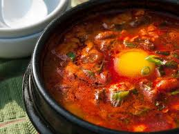
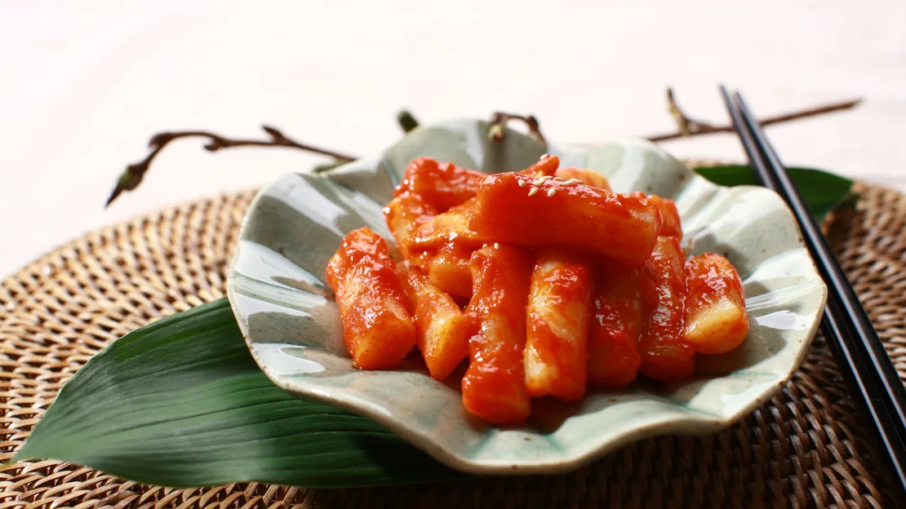
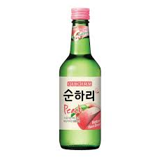

## Menu

[Korean Food](#korean-food) | ... | [Beverages](#beverages)

## Korean Food
| Name | Description | Image                 | Price |
|------|-------------|-----------------------|------|
| Kimchi | kimchi is the beloved spicy sidekick at every Korean table. It’s made by salting and preserving fermented cabbage in a bed of red chilli pepper, garlic, ginger and scallion. |  | 239  |
|Soft Tofu Stew|Soft tofu, clams and an egg in spicy broth? This popular stew is a classic example of unexpected flavor combinations yielding delightful sensations.The soft tofu – which breaks into fluffy chunks in the stew – holds the flavor of the clam and serves as a relief from the overall spiciness.|  | 205  |
|Tteokbokki|This iconic red-orange street food is so popular there’s an entire part of Seoul just devoted to the steamed and sliced rice cakes (tteok), cooked with fish cakes (oden) and scallions in a sweet and spicy sauce made of chili paste.| | 329  |
## Beverages

| Beverages name | Description | Image                    | Price |
|----------------|-------------|--------------------------|-------|
| Soju           |"Traditionally, soju is fermented white rice with a crisp flavor, a little apple, and sometimes a touch of burnt rice." Soju is often called the Korean vodka, since it's smooth, mild, and mostly neutral, but it clocks in at about half the alcohol content.|  | 145   