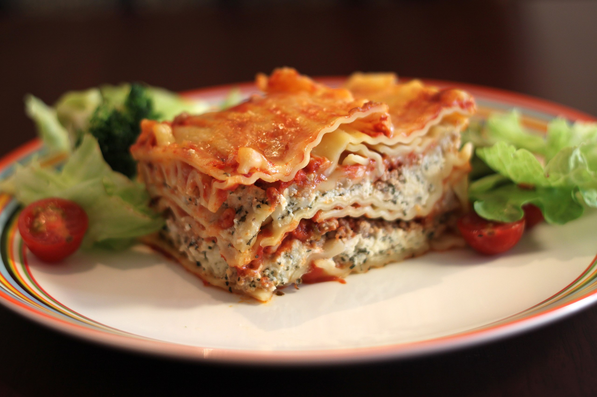
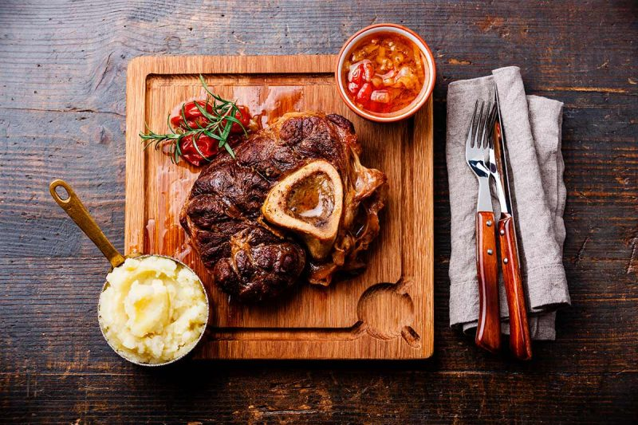
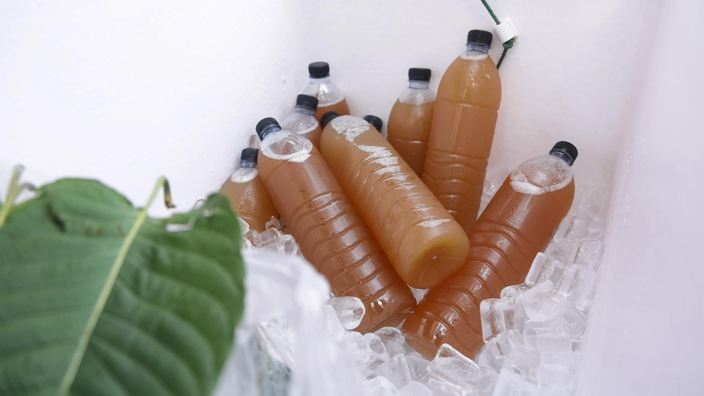

## Menu
[Italian Food](#italian-food) | ... | [Beverages](#beverages)

## Italian Food

| Name     | Description                                                                                                                     | Image                         | Price |
|:---------|:--------------------------------------------------------------------------------------------------------------------------------|-------------------------------|------:|
| Pizza    | Pizza is an Italian dish made of leavened dough topped with tomato, cheese, and other ingredients, baked at a high temperature. |     |   199 | 
| Pasta    | Pasta is made from wheat flour mixed with water or eggs, shaped, and then boiled or baked.                                      |     |   169 |
| Lasagna  | Lasagna is an Italian dish made of layers of pasta, meat or vegetables, cheese, and tomato sauce, baked until bubbly and golden.|   |   358 |
| Ossobuco | Ossobuco is a Milanese dish made from veal shanks braised with a mix of onions, carrots, garlic, tomatoes, and red wine.    |  |  1199 |

## Beverages
| Name       | Description | Image                     | Price |
|:-----------|:------------|---------------------------|------:|
| Kratom tea | Kratom tea is made from kratom leaves that are steeped in boiling water. It has a stimulant or opioid-like effect on the body, depending on the dosage.|  |    20 | 
