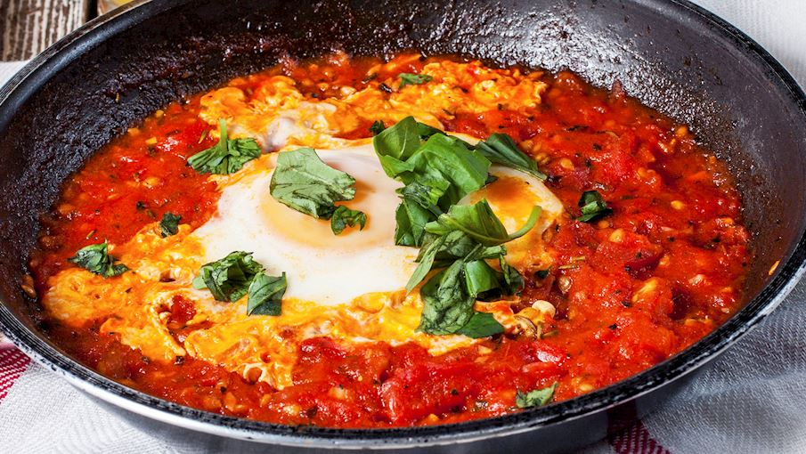

## Menu

[Yemeni](#yemeni-food) | ... | [Beverages](#beverages)

## Yemeni Food
| Name       | Description                                                                                                                                                                                                                                           | Image                  | Price |
|------------|-------------------------------------------------------------------------------------------------------------------------------------------------------------------------------------------------------------------------------------------------------|------------------------|----|
| Shakshouka | Shakshouka is a delicious combination of eggs poached in a spicy tomato sauce. Although it has an unusual name, the dish is straightforward and easy to make. It is usually made in a skillet in which onions, tomatoes, and spices are cooked until they form a delicious tomato sauce. |  | 84.69 |
| Martabak  | Martabak is a roti-like stuffed and fried pancake which is often served as a popular street food item in countries such as Saudi Arabia, Yemen, Indonesia, and Malaysia. Although the fillings may vary, some of the most popular ones include ground meat, eggs, garlic, onions, peppers, curry, and ghee. |  | 40 |
| Jachnun    | Jachnun is a traditional Yemenite Jewish pastry or flatbread (or something in-between) of Adeni Jewish origin. The Yemenite Jewish immigrants have also popularized the dish in Israel. It's traditionally served for breakfast on Shabbat morning. The dough is made with a cobination of flour, white sugar, water, and margarine. |     | 120 |

## Beverages

> A table of beverages. Each team member adds one beverage (one row) to the table.
> Result should be in alphabetical order by beverage name.

| Beverages name | Description | Image                            | Price |
|--------------|-------------|----------------------------------|-------|
| Shahi haleeb |It is made from black tea powder brewed in condensed or evaporated milk. Cardamom pods and cloves are usually added to the tea, some recipes include added sugar. |  |