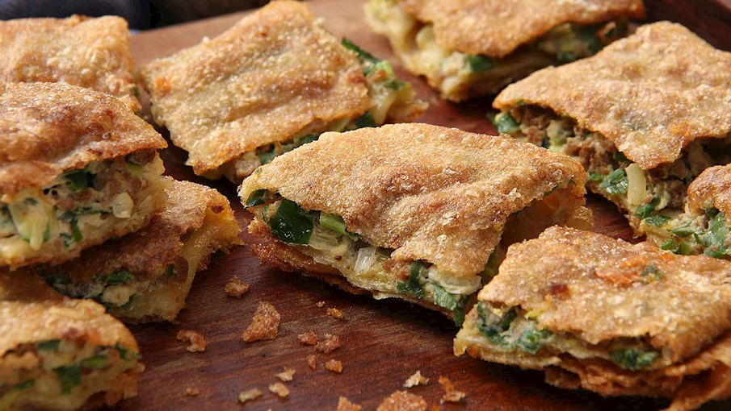
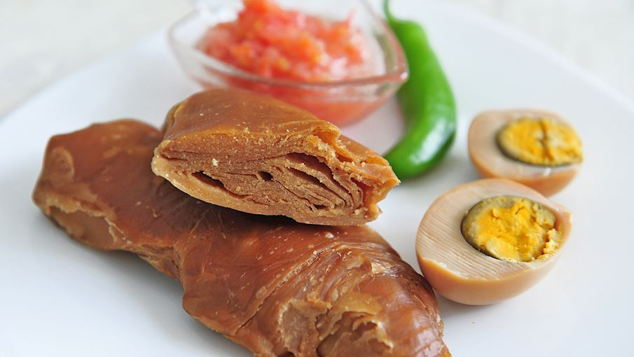
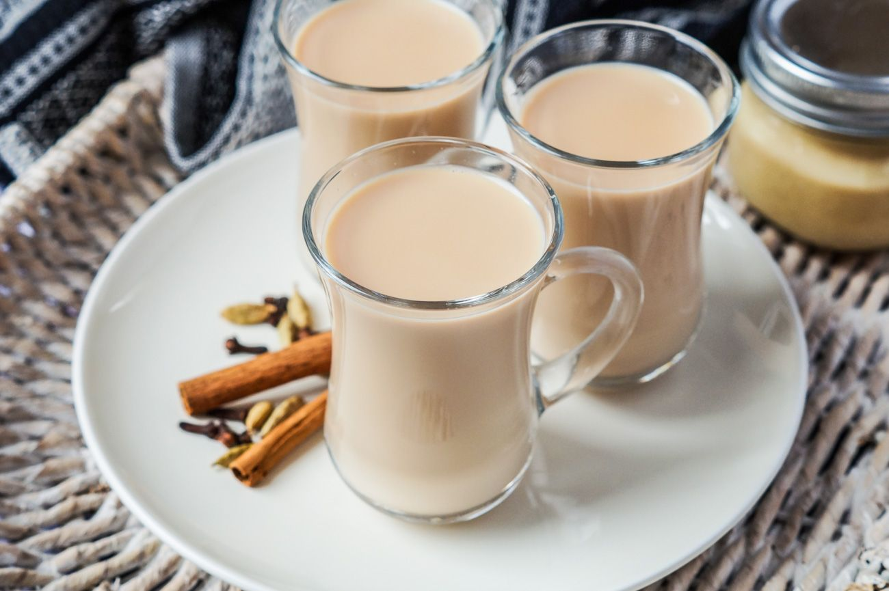

## Menu
[Indian Food](#indian-food) | [Italian Food](#italian-food) | [Yemeni](#yemeni-food) |[Beverages](#beverages)

## Indian Food

| Name     | Description                                                                                                                                                                                                                                             | Image                                | Price |
|:---------|:--------------------------------------------------------------------------------------------------------------------------------------------------------------------------------------------------------------------------------------------------------|--------------------------------------|------:|
| Pakora   | Savory deep-fried Indian snack made with chunks of vegetables such as potato, cauliflower and eggplant, or meat of choice                                                                                                                               |      |   899 |        
| Chaat    | The name chaat encompasses a wide variety of Indian street foods, snacks, or small meals which usually combine salty, spicy, sweet, and sour flavors.                                                                                                   |        |   600 |
| Vada Pav | Vada Pav is a favorite sandwich-style snack from Mumbai, named after its ingredients: vada, or spicy mashed potatoes, which are deep-fried in chickpea batter; and pav, or white bread rolls.                                                           |  |   977 |
| Idli     | Idli is a traditional, savory Indian cake that is a popular breakfast item in many South Indian households, although it can be found throughout the country. It is made with a batter consisting of fermented lentils and rice, which is then steamed.  |          |   799 |

## Italian Food

| Name     | Description                                                                                                                      | Image                         | Price |
|:---------|:---------------------------------------------------------------------------------------------------------------------------------|-------------------------------|------:|
| Pizza    | Pizza is an Italian dish made of leavened dough topped with tomato, cheese, and other ingredients, baked at a high temperature.  |     |   199 | 
| Pasta    | Pasta is made from wheat flour mixed with water or eggs, shaped, and then boiled or baked.                                       |     |   169 |
| Lasagna  | Lasagna is an Italian dish made of layers of pasta, meat or vegetables, cheese, and tomato sauce, baked until bubbly and golden. |   |   358 |
| Ossobuco | Ossobuco is a Milanese dish made from veal shanks braised with a mix of onions, carrots, garlic, tomatoes, and red wine.         |  |  1199 |

## Yemeni Food
| Name       | Description                                                                                                                                                                                                                                           | Image                                | Price |
|------------|-------------------------------------------------------------------------------------------------------------------------------------------------------------------------------------------------------------------------------------------------------|--------------------------------------|----|
| Shakshouka | Shakshouka is a delicious combination of eggs poached in a spicy tomato sauce. Although it has an unusual name, the dish is straightforward and easy to make. It is usually made in a skillet in which onions, tomatoes, and spices are cooked until they form a delicious tomato sauce. |  | 84.69 |
| Martabak  | Martabak is a roti-like stuffed and fried pancake which is often served as a popular street food item in countries such as Saudi Arabia, Yemen, Indonesia, and Malaysia. Although the fillings may vary, some of the most popular ones include ground meat, eggs, garlic, onions, peppers, curry, and ghee. |      | 75 |
| Jachnun    | Jachnun is a traditional Yemenite Jewish pastry or flatbread (or something in-between) of Adeni Jewish origin. The Yemenite Jewish immigrants have also popularized the dish in Israel. It's traditionally served for breakfast on Shabbat morning. The dough is made with a cobination of flour, white sugar, water, and margarine. |        | 120 |

## Beverages
| Name       | Description                                                                                                                                             | Image                     | Price |
|:-----------|:--------------------------------------------------------------------------------------------------------------------------------------------------------|---------------------------|------:|
| Kratom tea | Kratom tea is made from kratom leaves that are steeped in boiling water. It has a stimulant or opioid-like effect on the body, depending on the dosage. |  |    20 | 
| Sugarcane Juice | Sugarcane juice is the liquid extracted from pressed sugarcane. It is consumed as a beverage in many places, especially where sugarcane is commercially grown, such as Southeast Asia, the Indian subcontinent, North Africa, mainly Egypt, and also in South America. |  |    20 |        
| Shahi haleeb |It is made from black tea powder brewed in condensed or evaporated milk. Cardamom pods and cloves are usually added to the tea, some recipes include added sugar. |  | 80 |
