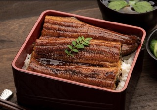

## Menu

[Japanese Food](#japanese-food) | ... | [Beverages](#beverages)

## Japanese Food
| Name              | Description                                                                                                                                                                                                                                                       | Image                            | Price |
|-------------------|-------------------------------------------------------------------------------------------------------------------------------------------------------------------------------------------------------------------------------------------------------------------|----------------------------------|-------|
| Unagi no Kabayaki | Unagi no kabayaki is made by brushing prepared eel fillets with a sweetened soy sauce-based kabayaki sauce and broiling them on a grill.                                                                                                                          |        | 570   |
| Tonkatsu          | Tonkatsu is made by coating pork chops in crisp panko breadcrumbs and deep-frying them until they are golden brown in colour.                                                                                                                                     |  | 360   |
| Gyoza             | Gyoza are savoury moon-shaped dumplings, made from a minced mixture of savoury fillings which are wrapped up in a circular gyoza wrapper and crimped or pleated around the edges to make an iconic half-moon shape. |        | 190    | 

## Beverages

| Beverages name | Description | Image                             | Price |
|----------------|-------------|-----------------------------------|-------|
|Green tea | Green tea comes from unoxidized leaves of the Camellia sinensis bush. It is one of the least processed types of tea, containing the most antioxidants and beneficial polyphenols.|  | 80    |